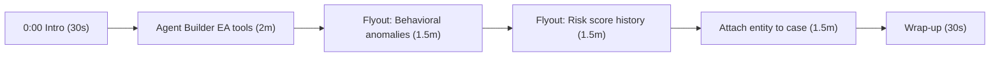

# EA 9.5 Demo Video — Recording Package

A turnkey package for recording a **5–8 minute customer demo** that introduces the new
Entity Analytics (EA) capabilities delivered since **9.5**. It contains everything the
presenter needs: environment setup, a storyboard/shot list, click‑by‑click actions, and a
word‑for‑word narration track.

> This document does not record or render a video. It makes recording one turnkey: follow
> the setup, then read the narration while performing the on‑screen actions in order.

---

## 1. What this video introduces

Four new EA experiences shipped since 9.5:

1. **Agent Builder tools & skill for EA** — ask an AI agent natural‑language questions and let
   it query the entity store, risk scores, and asset criticality on your behalf.
2. **Entity flyout — Behavioral anomalies section** — ML anomalies surfaced directly in the
   entity flyout, mapped to MITRE ATT&CK.
3. **Entity flyout — Risk score history** — a time‑series of an entity's risk score with
   point‑in‑time drill‑down into the contributions behind each score.
4. **Attaching entities to cases** — attach a host/user/service entity to a case so
   investigators keep the entity (and its risk snapshot) alongside the rest of the evidence.

**Audience:** customers / prospects. **Tone:** benefit‑led, plain language, minimal jargon.
**Target length:** ~7 minutes.

> Verification note: The exact UI labels below were taken from the 9.5 source (file paths are
> cited in the [Appendix](#appendix-a--feature-to-code-map)). Confirm strings against the
> specific build you record on, since these features are still gated by experimental flags and
> wording can change between minor releases.

---

## 2. Prerequisites & environment setup

Target environment: **stateful** Security (local dev via `yarn start`, or an ESS deployment).
Every feature in this demo is currently behind an **experimental flag**, so set these up
before recording — nothing here is on by default.

### 2.1 Experimental flags

Add to `config/kibana.dev.yml` (local dev) or the Kibana settings of your ESS deployment, then
restart Kibana:

```yaml
xpack.securitySolution.enableExperimental:
  - entityAnalyticsEntityStoreV2      # Agent Builder EA tools (get/search entity, set asset criticality)
  - entityAnalyticsAnomalyDetails     # Entity flyout: "Behavioral anomalies" section + full view
  - riskScoreHistoryEnabled           # Entity flyout: "Risk score history" timeline + point-in-time
  - entityAttachmentsEnabled          # Attach entities to cases
```

Optional, only if you also want to demo watchlists / AI leads in Agent Builder:

```yaml
  - entityAnalyticsWatchlistEnabled   # watchlist create/update/add-remove tools + "manage-watchlists" skill
  - leadGenerationEnabled             # "entity-analytics-leads" skill (list/generate/dismiss leads)
```

### 2.2 Licensing & AI configuration (for Agent Builder)

- **Enterprise license** (trial license is fine for a demo).
- A configured **LLM connector** (e.g. Azure OpenAI, Bedrock, Gemini) in Stack Management →
  Connectors.
- **AI Chat Experience** set to **Agent** mode (not the Classic Assistant). Agent Builder lives
  at `/app/agent_builder` and is labeled **Agents** in the navigation.

### 2.3 Data setup (do this well before recording so scores/history exist)

1. **Enable the entity store** so entities get a canonical entity ID (EUID). Entity Analytics →
   enable, or `POST /api/entity_store/enable`. Every feature here needs an entity with an
   `entity.id` — anomalies, risk history, and case attachment are all keyed off it.
2. **Enable the risk engine** and let it run **several times** (or trigger it a few times over a
   period). Risk score **history** only shows a meaningful line once multiple scoring runs
   exist.
3. **ML anomaly detection jobs**: install and start the Security ML jobs (e.g. the prebuilt
   host/user modules) and let them process enough data to produce anomalies in the **last 30
   days**. Pick a demo entity that actually has anomalies.
4. **Role/privileges** for the recording user:
   - ML read (`ml.canGetJobs`, read on `.ml-anomalies-*`) — required for the anomalies section
     to render.
   - Entity Analytics read — required to view attached entities in a case.
   - Cases **create / update / createComment** — required for the "Add to … case" actions to
     appear.

### 2.4 Pick your "hero" entity in advance

Choose one host or user that has: a non‑trivial **risk score**, at least a few **anomalies** in
the last 30 days, and several **contributing alerts**. Rehearse with this entity so the flyout
looks rich on camera. Note its name so you can jump straight to it.

### 2.5 Pre‑flight checklist (run through right before hitting record)

- [ ] Kibana restarted after adding the four experimental flags.
- [ ] LLM connector configured; AI Chat Experience = **Agent**.
- [ ] Entity store enabled; hero entity resolves with a risk score.
- [ ] Risk engine has run multiple times (history chart shows more than one point).
- [ ] ML jobs running; hero entity shows anomalies in the last 30 days.
- [ ] A couple of **existing cases** already created (so "Add to existing case" has options).
- [ ] Browser zoom ~110–125%, window maximized, demo data only (no real customer PII on screen).
- [ ] Global time picker set to a range that includes your data (e.g. Last 30 days).

---

## 3. Storyboard / shot list



| # | Scene | Screen | Time | Running |
|---|-------|--------|------|---------|
| 0 | Intro | Security → Entity Analytics home | 0:30 | 0:30 |
| 1 | Agent Builder EA tools | Agent Builder (`/app/agent_builder`) | 2:00 | 2:30 |
| 2 | Behavioral anomalies | Entity flyout → anomalies section + full view | 1:30 | 4:00 |
| 3 | Risk score history | Entity flyout → Risk score detail | 1:30 | 5:30 |
| 4 | Attach entity to case | Flyout → Take action → case; then the case | 1:30 | 7:00 |
| 5 | Wrap‑up | Entity Analytics home | 0:30 | 7:30 |

> Timings are guidance and total ~7:30; trimming the setup chatter comfortably lands inside
> the 5–8 minute target. Each scene below gives three synced columns: **Shot / screen**,
> **On‑screen actions**, and **Narration** (read aloud).

---

## 4. Scene‑by‑scene script

Narration is written for roughly 130 words per minute. Read at a relaxed pace; pause on each
click so the viewer can follow.

### Intro (0:00–0:30)

| Shot / screen | On‑screen actions | Narration |
|---|---|---|
| Security → **Entity Analytics** home page. Cursor idle. | Open **Security → Entity Analytics** (`/app/security/entity_analytics_home_page`). Let the risk overview and entities render. | "Entity Analytics gives you a single, risk‑ranked view of the hosts, users, and services in your environment. Since 9.5 we've made it dramatically faster to investigate — with an AI agent that can query your entities for you, richer detail inside every entity, and a direct path from an entity into a case. Let's walk through what's new." |

---

### Scene 1 — Agent Builder tools & skill for EA (0:30–2:30)

**Goal:** show that you can ask questions in plain language and the agent uses purpose‑built
Entity Analytics tools to answer, returning rich, interactive entity cards.

| Shot / screen | On‑screen actions | Narration |
|---|---|---|
| Navigate to **Agent Builder**. | From the global nav, open **Agents** (`/app/agent_builder`). | "First, Agent Builder. This is our AI agent experience, and in 9.5 it understands Entity Analytics natively." |
| **Manage → Skills / Tools** (brief). | Open **Manage → Skills**; point at the **entity‑analytics** skill. Optionally **Manage → Tools** to show the `security.*` tools. | "Behind the scenes there's a dedicated Entity Analytics skill, backed by tools that can search your entity store, pull a full entity profile, and even set asset criticality — all governed by the same permissions your analysts already have." |
| Chat view. Type prompt 1. | Ask: **"Show me the riskiest users right now."** Wait for the response. | "Instead of building a query, I just ask. The agent calls the search‑entities tool against the entity store…" |
| Response renders an **entity table** (Canvas attachment). | Point at the returned ranked table of entities. | "…and gives me back a ranked, interactive table — not just text. These are live entities from my store." |
| Type prompt 2. | Ask: **"Tell me about \<hero entity name\>."** Wait for the entity card. | "I can drill into any one of them. Here it pulls the full profile — the risk score, what's driving it, and the alerts that contributed." |
| **Entity card** attachment renders. | Hover the risk inputs / contributing alerts on the card. | "Everything an analyst needs to triage, summarized in seconds. And because this is grounded in the entity store, the agent will even tell me if the risk engine hasn't run recently — so I can trust what I'm seeing." |

> Optional add‑on (only if `entityAnalyticsWatchlistEnabled` / `leadGenerationEnabled` are on):
> ask *"Add \<entity\> to the \<name\> watchlist"* or *"What investigation leads do you have?"* —
> note that write actions (watchlist changes, setting criticality) prompt for confirmation
> before executing.

---

### Scene 2 — Entity flyout: Behavioral anomalies (2:30–4:00)

**Goal:** open an entity's flyout and show ML anomalies in context, mapped to MITRE ATT&CK, with
a full drill‑down view.

| Shot / screen | On‑screen actions | Narration |
|---|---|---|
| Entity Analytics home, entities/risk table. | Click your **hero entity's** name to open its **flyout** (right panel). | "Now let's open an entity directly. This flyout is the investigator's home base for a host or user." |
| Flyout body, scroll to **Behavioral anomalies** accordion. | Scroll to the **Behavioral anomalies** section (open by default). | "New in 9.5: Behavioral anomalies, right here in the flyout. These come from machine learning jobs watching this entity over the last 30 days." |
| Point at count + **MITRE ATT&CK** chain + recent anomalies. | Hover the anomaly count, the MITRE tactic chain, and the recent anomalies list. | "I get the total count, the anomalies mapped to MITRE ATT&CK tactics, and the most recent examples — so I immediately understand not just *that* something's unusual, but *how* it maps to attacker behavior." |
| Open the full view. | Click **All anomalies**. The full anomalies view opens (left panel tab, or a tool flyout on the new flyout). | "For the full picture I open all anomalies." |
| Full anomalies view. | Show the **timeline/swimlane**, the **severity** filter, and the sortable **table** with anomaly scores. Optionally expand a row. | "Here's a timeline of anomalous activity, filterable by severity, and a detailed table scored zero to one hundred. From any row I can jump into the ML viewer, into Discover, or add it to a Timeline — so investigation flows without breaking context." |

> New‑flyout note: with the new flyout enabled, "All anomalies" opens a dedicated tool flyout
> (`AnomalyInsights`) rather than expanding a left panel. The content is the same.

---

### Scene 3 — Entity flyout: Risk score history (4:00–5:30)

**Goal:** stay in the same flyout, open the Risk score detail, and show the risk trend over time
with point‑in‑time contribution drill‑down.

| Shot / screen | On‑screen actions | Narration |
|---|---|---|
| Same flyout, **Risk score** summary accordion. | Scroll to the **Risk score** accordion; point at the score gauge and the **Entity risk contributions** breakdown. | "Let's talk about risk. The summary shows the current score and what's contributing — alerts, asset criticality, and more." |
| Open the risk detail. | Click the expand chevron on **Entity risk contributions** (or **Expand details** → **Risk score** tab). | "But a single number doesn't tell the story. Let's open the detail." |
| **Risk score history** chart. | Point at the **Risk score history** line chart; switch ranges **7d / 30d / 90d / 1y**; note the dashed risk‑level threshold lines. | "New in 9.5: risk score history. I can see how this entity's risk has moved over the last week, month, quarter, or year, with the Low/Medium/High/Critical thresholds marked. A sudden spike is exactly what I want to investigate." |
| Point‑in‑time drill‑down. | Click a **point** on the chart at a spike. The **Contexts** and **Alerts** tables update to that moment; a callout appears. | "And I can click any point in time. Watch the contributions below — the alerts and context tables rewind to exactly what drove the score *at that moment*. So I'm not guessing why risk jumped; I can see it." |
| Restore latest. | Click **Back to latest**. | "One click takes me back to the current state. This turns a static score into a story you can actually investigate." |

---

### Scene 4 — Attach entities to cases (5:30–7:00)

**Goal:** attach the entity to a case from the flyout, then show how it appears inside the case.

| Shot / screen | On‑screen actions | Narration |
|---|---|---|
| Entity flyout footer. | In the flyout **footer**, click **Take action**. | "Once I've decided this entity matters, I want it in my investigation. From the flyout I click Take action." |
| Take action menu. | Point at **Add to new case** and **Add to existing case**. Choose one (new case is cleanest on camera). | "New in 9.5, I can attach the entity straight to a case — either a brand‑new one or an existing investigation." |
| Case create/attach dialog. | Fill in the case (or pick an existing one) and confirm. Click the **View case** toast link. | "I'll create the case and jump right to it." |
| Case → **Activity** tab. | Show the **"added an entity"** activity event; expand it to show name, type, and the risk snapshot. | "Inside the case, the entity shows up in the activity timeline — with its name, type, and a snapshot of its risk level at the time I attached it. That context travels with the case." |
| Case → **Attachments → Entities** accordion. | Open the **Entities** section; show the Entity Analytics table scoped to the attached entity. | "And under attachments, there's a dedicated Entities view — the same rich Entity Analytics table, scoped to what I've attached. My case team now has the entity, its risk, and everything else in one place." |

> Supported today from the flyout: **host, user, and service** entities. Cases privileges
> (create/update + createComment) and Entity Analytics read control what's visible.

---

### Wrap‑up (7:00–7:30)

| Shot / screen | On‑screen actions | Narration |
|---|---|---|
| Return to **Entity Analytics** home. | Navigate back to the Entity Analytics home page. | "So that's what's new in Entity Analytics since 9.5: an AI agent that speaks Entity Analytics, machine‑learning anomalies and risk history right inside every entity, and a one‑click path from an entity into a case. Together they take you from a ranked list of risk to a documented investigation — faster than ever. Thanks for watching." |

---

## 5. Recording tips

- **Resolution & zoom:** record at 1080p minimum; browser zoom 110–125% so text is legible.
- **Cursor:** enable cursor highlighting/click emphasis in your screen recorder.
- **One take per scene:** record each scene separately; it's far easier to re‑do a scene than
  the whole run. Leave ~1s of silence at the start/end of each clip for clean edits.
- **Data hygiene:** use demo/synthetic data only; no real customer names, IPs, or emails on
  screen. Blur if needed in post.
- **Latency:** LLM responses can take a few seconds. Either wait silently and trim in the edit,
  or record the agent responses first and narrate over them.
- **Consistency:** use the same hero entity across scenes 2–4 so the story feels continuous.
- **Captions:** the narration in this doc doubles as a caption/subtitle script.

---

## Appendix A — Feature → code map

Reference paths in `x-pack/solutions/security/plugins/security_solution` (9.5 source) for anyone
who wants to verify UI strings or behavior before recording:

| Feature | Key code |
|---|---|
| Experimental flags | `common/experimental_features.ts` |
| Agent Builder app | platform plugin `x-pack/platform/plugins/shared/agent_builder` (app id `agent_builder`, `/app/agent_builder`) |
| EA skill | `server/agent_builder/skills/entity_analytics/entity_analytics_skill.ts` |
| EA tools | `server/agent_builder/tools/entity_analytics/` (`security.get_entity`, `security.search_entities`, `security.set_asset_criticality`, watchlist tools, leads tools) |
| Entity Canvas attachments | `common/constants.ts` (`SecurityAgentBuilderAttachments`: `security.entity`, `security.entity_analytics_dashboard`) |
| Anomalies section | `public/entity_analytics/components/anomalies/anomalies_section.tsx`, `anomalies_overview.tsx` |
| Anomalies full view | `public/entity_analytics/components/anomalies/anomalies_tab.tsx`; v2 `public/flyout_v2/entity/shared/tools/anomaly_insights/index.tsx` |
| Risk summary | `public/entity_analytics/components/risk_summary_flyout/risk_summary.tsx` |
| Risk score history | `public/entity_analytics/components/risk_score_timeline/risk_score_timeline.tsx`; tab in `entity_details_flyout/tabs/risk_inputs/risk_inputs_tab.tsx` |
| Entity → case attachment | Cases: `x-pack/platform/plugins/shared/cases/common/constants/attachments.ts` (`SECURITY_ENTITY_ATTACHMENT_TYPE = 'security.entity'`); UI: `public/cases/attachments/entity/` and flyout `.../shared/components/take_action.tsx` |

## Appendix B — Demo prompts for Agent Builder

Copy‑paste prompts that map to real EA tools:

- "Show me the riskiest users right now." → `security.search_entities`
- "List the top 10 hosts by risk score." → `security.search_entities`
- "Which critical AWS entities have a high risk score?" → `security.search_entities` (filters)
- "Tell me about `<entity name>`." → `security.get_entity`
- "What alerts contributed to `<entity>`'s risk score?" → `security.get_entity`
- "Set asset criticality for `<entity>` to high." → `security.set_asset_criticality` (confirmation prompt)
- (watchlists on) "Add `<entity>` to the `<name>` watchlist." → watchlist tools (confirmation)
- (leads on) "What investigation leads do you have?" → `security.list_leads`

## Appendix C — Feature → flag quick reference

| Feature | Experimental flag(s) | Extra requirements |
|---|---|---|
| Agent Builder EA tools | `entityAnalyticsEntityStoreV2` | Enterprise license, LLM connector, Agent chat mode, entity store enabled |
| Behavioral anomalies | `entityAnalyticsAnomalyDetails` | Entity store (EUID), ML jobs running, ML read privileges |
| Risk score history | `riskScoreHistoryEnabled` | Entity store (EUID), risk engine run multiple times |
| Attach entities to cases | `entityAttachmentsEnabled` | Entity store (EUID), Cases create/update + createComment, EA read |
| Watchlists in chat (optional) | `entityAnalyticsWatchlistEnabled` | Agent Builder prerequisites |
| AI leads in chat (optional) | `leadGenerationEnabled` | Agent Builder prerequisites |
